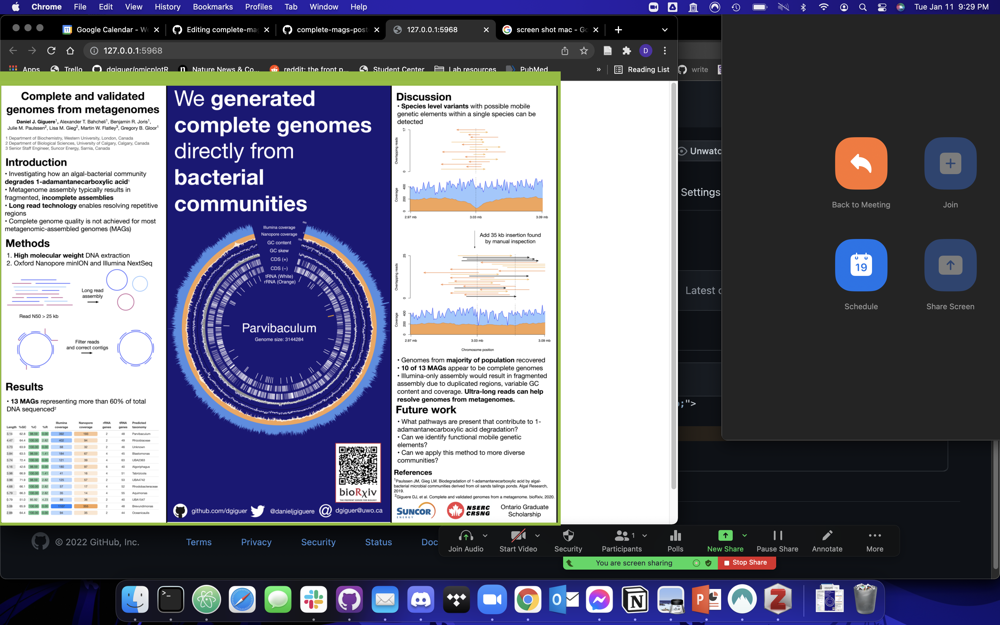

# Complete and validated genomes poster for Biochemistry poster day


The static version is located as a `pdf` in the top level. 

To run the interacative version on macOS/Linux: 

1) Clone this repository and ensure your working directory is set to the `shiny` directory: 

```
# if you don't have git installed, you can just click "Download"
git clone https://github.com/dgiguer/complete_mags_poster.git
cd complete_mags_poster/shiny
```

2) Open R, install shiny, run the app

```
# install the shiny package if not already installed
install.packages("shiny")

library(shiny)

runApp("poster_shiny.R")
```

This should launch in your default browser, it has only been tested in Chrome. 

### To customize: 

This format worked well during a live Zoom call while sharing only a selected region of a Chrome window adjusted to size, hiding the dropdown menus until I scrolled down. It really helped to have two screens!



The Shiny app works by displaying 3 images: left, center, and right. I used a vector editing program (Omnigraffle, but Inkscape will work too) to make the poster and export high quality images in these sections. 

The left section is an image and can be replaced by uploading a file to [./shiny/figs/](./shiny/figs) and changing the file name [here](https://github.com/dgiguer/complete-mags-poster/blob/40cdf34699fc73c23cc5ae684fc3d846cb4a07ca/shiny/left.html#L3). 

The middle section is an HTML background, a separate image for the [header](https://github.com/dgiguer/complete-mags-poster/blob/40cdf34699fc73c23cc5ae684fc3d846cb4a07ca/shiny/middle.html#L1) and [footer](https://github.com/dgiguer/complete-mags-poster/blob/40cdf34699fc73c23cc5ae684fc3d846cb4a07ca/shiny/middle.html#L9). The middle, i.e., the genome, is chosen by the [HTML dropdown menu,](https://github.com/dgiguer/complete-mags-poster/blob/40cdf34699fc73c23cc5ae684fc3d846cb4a07ca/shiny/middle.html#L14) which then takes the value of the [menu option](https://github.com/dgiguer/complete-mags-poster/blob/40cdf34699fc73c23cc5ae684fc3d846cb4a07ca/shiny/middle.html#L15), to concatenate it into the [file name to be displayed](https://github.com/dgiguer/complete-mags-poster/blob/40cdf34699fc73c23cc5ae684fc3d846cb4a07ca/shiny/poster_shiny.R#L22). The value of the dropdown menu must therefore match the file name in ./shiny/figs/VALUE.png. The colours can be changed in the first line of the *.html files. 

The right section uses the same approach as the middle, but alternates between two full size images. 

In retrospect, it's probably easier to have several full sizes images of the middle section (like the right section) instead of combining the multiple elements in HTML afterwards.

