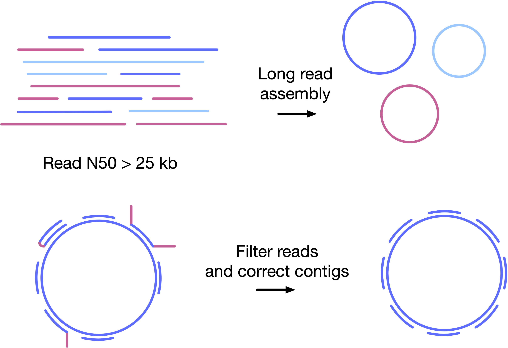
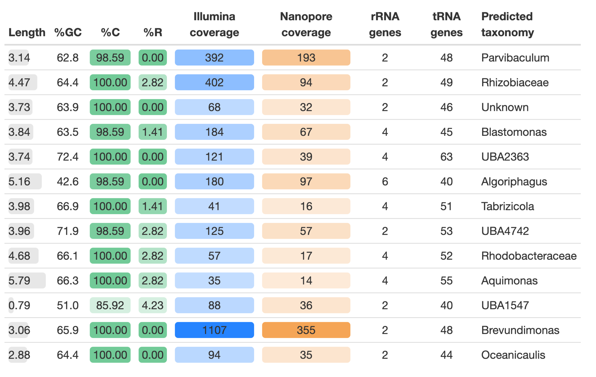

# Complete and validated genomes from metagenomes

Daniel J. Giguere1, Alexander T. Bahcheli1, Benjamin R. Joris1, 
Julie M. Paulssen2, Lisa M. Gieg2, Martin W. Flatley3, Gregory B. Gloor1

1 Department of Biochemistry, Western University, London, Canada
2 Department of Biological Sciences, University of Calgary, Calgary, Canada
3 Senior Staff Engineer, Suncor Energy, Sarnia, Canada

# Introduction

Metagenome assembly results in fragmented incomplete assemblies
Long read technology allows resolving of repetitive regions
Validation of algorithm output is necessary to ensure  genomes are not misassembled

# Methods 

High molecular weight DNA extraction
Oxford Nanopore minION and Illumina NextSeq 550

# Results 

13 complete genomes representing more than 60% of total DNA sequenced

